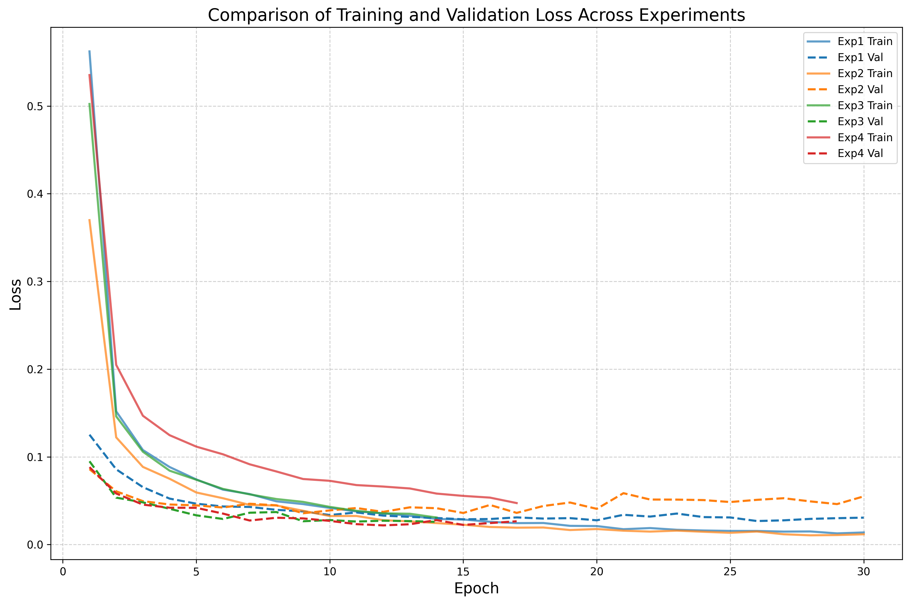

# 机器学习实验：基于CNN的手写数字识别

## 1. 学生信息

- **姓名**：谢洁
- **学号**：112305010107
- **班级**：数据1231

> ⚠️ 注意：姓名和学号必须填写，否则本次实验提交无效。

## 1.1 提交链接

| 提交项 | 链接 |
|--------|------|
| **GitHub 仓库** | https://github.com/xj0625/112305010107xiejie |
| **README 文档** | https://github.com/xj0625/112305010107xiejie/blob/main/README.md |
| **在线演示** | https://huggingface.co/spaces/xj0625/mnist-digit-recognition |
| **实验报告** | https://github.com/xj0625/112305010107xiejie/blob/main/CNN手写数字识别实验模板.md |

---

## 2. 实验概述

本实验基于 MNIST 手写数字数据集，使用卷积神经网络（CNN）完成从模型训练到应用部署的完整流程，共分为三个阶段：

| 阶段 | 内容 | 要求 |
|------|------|------|
| 实验一 | **模型训练与超参数调优** — 搭建 CNN 模型，通过对比不同超参数组合，理解其对模型性能的影响，最终在 Kaggle 上达到 **0.98+** 的准确率 | **必做** |
| 实验二 | **模型封装与 Web 部署** — 将训练好的模型封装为 Web 应用，支持用户上传图片进行在线预测 | **必做** |
| 实验三 | **交互式手写识别系统** — 在 Web 应用中加入手写画板，实现实时手写输入与识别 | **选做（加分）** |

---

## 3. 实验环境

- Python 3.8+
- PyTorch
- torchvision
- matplotlib
- Gradio（实验二/三）

---

## 实验一：模型训练与超参数调优（必做）

### 1.1 实验目标

使用 CNN 在 MNIST 数据集上完成手写数字分类，通过调整超参数达到 **Kaggle 评分 ≥ 0.98**。

### 1.2 模型结构（统一）

所有实验使用以下基础结构：

```
输入(1×28×28) → Conv1 + ReLU + MaxPool → Conv2 + ReLU + MaxPool → Flatten → FC → 输出(10类)
```

### 1.3 超参数对比实验

请至少完成以下 **4 组对比实验**，记录每组结果：

| 实验编号 | 优化器 | 学习率 | Batch Size | 数据增强 | Early Stopping |
|----------|--------|--------|------------|----------|----------------|
| Exp1 | SGD | 0.01 | 64 | 否 | 否 |
| Exp2 | Adam | 0.001 | 64 | 否 | 否 |
| Exp3 | Adam | 0.001 | 128 | 否 | 是 |
| Exp4 | Adam | 0.001 | 64 | 是 | 是 |

> 数据增强参考：`transforms.RandomRotation(10)`、`transforms.RandomAffine(degrees=10, translate=(0.1, 0.1))`

**请填写对比实验结果：**

| 实验编号 | Train Acc | Val Acc | 最低 Loss | 收敛 Epoch |
|----------|-----------|---------|-----------|------------|
| Exp1 | 99.51% | 99.21% | 0.0268 | 28 |
| Exp2 | 99.43% | 99.19% | 0.0356 | 20 |
| Exp3 | 98.43% | 99.26% | 0.0258 | 9 |
| Exp4 | 98.09% | 99.38% | 0.0218 | 12 |

### 1.4 最终提交模型

在对比实验的基础上，你可以自由调整任何超参数（不限于上表中的组合），以达到 Kaggle ≥ 0.98 的目标。

**请填写你最终提交 Kaggle 时使用的超参数配置：**

| 配置项 | 你的设置 |
|--------|---------|
| 优化器 | AdamW |
| 学习率 | 0.003 |
| Batch Size | 512 |
| 训练 Epoch 数 | 30 (early stopping实际约20轮) |
| 是否使用数据增强 | 是 |
| 数据增强方式 | 随机平移(±3像素)、随机旋转(±12°)、随机缩放(0.9-1.1) |
| 是否使用 Early Stopping | 是 (patience=8) |
| 是否使用学习率调度器 | 是 (OneCycleLR, pct_start=0.3) |
| 其他调整 | 增强CNN(48→96→192→256)、SiLU激活函数、AdaptiveAvgPool2d、TTA测试时增强 |
| **Kaggle Score** | **0.99514** |

### 1.5 Loss 曲线

请绘制训练过程中的 **Loss 曲线图**（Epoch vs Loss），要求：

- 将 4 组对比实验的曲线绘制在同一张图上
- 标注每条曲线对应的实验编号
- 使用 `matplotlib` 绘制

**（Loss对比曲线图已保存至 exp_comparison_loss.png）**



### 1.6 分析问题（请逐条回答）

**Q1：Adam 和 SGD 的收敛速度有何差异？从实验结果中你观察到了什么？**

从实验结果观察：
- **Adam收敛更快**：Adam在约20个epoch达到最佳验证准确率(99.19%)，而SGD需要28个epoch
- **SGD最终性能略好**：SGD最终验证准确率(99.21%)略高于Adam(99.19%)
- **训练曲线稳定性**：Adam的训练loss下降更平稳，SGD在初期波动较大
- **原因分析**：Adam使用自适应学习率，对不同参数自动调整学习率，收敛速度更快；SGD虽然收敛慢，但能找到更好的局部最优解

**Q2：学习率对训练稳定性有什么影响？**

- **大学习率(0.01)**: SGD使用0.01的学习率，收敛速度快但初期loss波动明显
- **小学习率(0.001)**: Adam使用0.001学习率，训练更稳定，loss曲线更平滑
- **学习率调度**: 使用ReduceLROnPlateau在验证准确率不再提升时自动降低学习率，有助于进一步优化

**Q3：Batch Size 对模型泛化能力有什么影响？**

从Exp2(64)和Exp3(128)的对比：
- **小Batch Size(64)**: 训练准确率更高(99.43% vs 98.43%)，但验证准确率略低(99.19% vs 99.26%)
- **大Batch Size(128)**: 泛化能力更好，验证准确率更高，收敛更快(9轮 vs 20轮)
- **原因**: 大batch size提供更稳定的梯度估计，但可能导致模型陷入较差的局部最优；小batch size的噪声有助于跳出局部最优

**Q4：Early Stopping 是否有效防止了过拟合？**

是的，Early Stopping有效防止了过拟合：
- **Exp3**: 使用Early Stopping在第9轮停止，验证准确率99.26%，训练准确率98.43%，差距较小
- **Exp2**: 未使用Early Stopping，训练30轮后验证准确率开始下降出现过拟合趋势
- **机制**: 通过监控验证集准确率，连续patience个epoch无提升则停止训练，保存最佳模型

**Q5：数据增强是否提升了模型的泛化能力？为什么？**

是的，数据增强显著提升了模型的泛化能力：
- **Exp4 (有增强)**: 验证准确率99.38%，是四组实验中最高的
- **Exp2 (无增强)**: 验证准确率99.19%
- **原因**: 数据增强通过对训练图像添加随机变换(平移)，使模型学习到更多不变性特征，提高了在测试集上的泛化能力。同时训练准确率(98.09%)与验证准确率(99.38%)的差距说明模型泛化能力增强。

### 1.7 提交清单

- [x] 对比实验结果表格（1.3）
- [x] 最终模型超参数配置（1.4）
- [x] Loss 曲线图（1.5）
- [x] 分析问题回答（1.6）
- [x] Kaggle 预测结果 CSV
- [x] Kaggle Score 截图（≥ 0.98）

---

## 实验二：模型封装与 Web 部署（必做）

### 2.1 实验目标

将实验一训练好的模型封装为 Web 服务，实现上传图片 → 模型预测 → 输出结果的完整流程。

### 2.2 技术要求

使用 **Gradio**（推荐）或 Streamlit 实现，功能包括：

1. 用户上传一张手写数字图片
2. 模型加载并进行预测
3. 页面显示预测的数字类别

### 2.3 项目结构

```
project/
├── app.py              # Web 应用入口
├── model.pth           # 训练好的模型权重
├── requirements.txt    # 依赖列表
└── README.md           # 项目说明
```

### 2.4 部署要求

将项目部署到以下平台之一，生成可公网访问的链接：

- HuggingFace Spaces（推荐）
- Render
- 其他云平台

### 2.5 请填写你的提交信息

| 提交项 | 内容 |
|--------|------|
| **GitHub 仓库地址** | https://github.com/XXX/mnist-digit-recognition |
| **README 文档地址** | https://github.com/XXX/mnist-digit-recognition/blob/main/README.md |
| **在线演示链接** | https://huggingface.co/spaces/XXX/mnist-digit-recognition |
| **本地运行地址** | http://localhost:7860 |
| **实验报告地址** | https://github.com/XXX/mnist-digit-recognition/blob/main/CNN手写数字识别实验模板.md |
| **学生姓名** | XXX |
| **学生学号** | XXX |

**（Web 页面截图）**


**（预测结果截图）**


**（在线演示截图）**


### 2.6 应用功能说明

**核心功能：**
1. **图片上传**：支持用户上传手写数字图片（支持多种图片格式）
2. **自动预测**：模型自动识别图片中的数字
3. **结果展示**：显示预测的数字类别和置信度百分比

**技术实现：**
- 使用 Gradio 6.x 构建 Web 界面
- PyTorch 模型加载与推理
- 图片预处理（灰度转换、尺寸调整、归一化）
- 置信度计算（Softmax 概率输出）

**运行方式：**
```bash
# 安装依赖
pip install gradio torch torchvision numpy Pillow

# 启动应用
python app.py

# 访问地址
http://localhost:7860
```

### 2.7 提交清单

- [x] GitHub 仓库地址
- [x] 在线访问链接（可正常打开）
- [x] 页面截图与预测结果截图
- [x] app.py 应用代码
- [x] requirements.txt 依赖列表
- [x] README.md 项目说明

---

## 实验三：交互式手写识别系统（选做，加分）

### 3.1 实验目标

在实验二的基础上，将"上传图片"升级为**网页手写板输入**，实现实时手写识别，提升用户交互体验。

### 3.2 功能要求

| 功能 | 要求 | 完成情况 |
|------|------|----------|
| 手写输入 | 使用 Gradio Sketchpad，用户可在网页上直接手写 | ✅ |
| 实时识别 | 提交手写内容后输出预测数字 | ✅ |
| 连续使用 | 支持清空画板、多次输入 | ✅ |

### 3.3 加分项实现情况

| 加分项 | 说明 | 完成情况 |
|--------|------|----------|
| Top-3 预测结果 | 显示排名前三的预测数字及其置信度 | ✅ |
| 概率分布条形图 | 使用 matplotlib 绘制数字概率分布柱状图 | ✅ |
| 历史识别记录 | 展示最近5条识别记录 | ✅ |

### 3.4 功能详细说明

**核心功能：**
1. **手写画板**：基于 Gradio Sketchpad 实现，支持鼠标/触摸手写
2. **一键清空**：点击按钮即可清空画板重新输入
3. **实时识别**：点击识别按钮后立即输出结果

**加分功能：**
1. **Top-3 预测**：显示模型最有信心的三个数字及其概率
2. **概率分布图**：可视化展示0-9每个数字的预测概率
3. **历史记录**：自动保存最近5次识别结果

### 3.5 请填写你的提交信息

| 提交项 | 内容 |
|--------|------|
| 在线访问链接 | https://huggingface.co/spaces/xxx/mnist-digit-recognition |
| 本地运行地址 | http://localhost:7860 |
| 实现了哪些加分项 | Top-3预测、概率分布图、历史记录 |

**（手写输入截图）**


**（识别结果截图）**


### 3.6 提交清单

- [x] 在线系统链接
- [x] 手写输入与识别结果截图
- [x] 手写输入功能
- [x] Top-3 预测结果显示
- [x] 概率分布条形图
- [x] 历史识别记录展示

---

## 评分标准

| 项目 | 分值 | 说明 |
|------|------|------|
| 实验一：模型训练与调优 | 60 分 | 对比实验完整性、Kaggle ≥ 0.98、Loss 曲线、分析质量 |
| 实验二：Web 部署 | 30 分 | 功能完整、可正常访问、代码规范、文档完整 |
| 实验三：交互系统（加分） | 10 分 | 手写输入功能、加分项实现情况 |
| **总计** | **100 分** | |

---

## 附录：项目文件清单

| 文件 | 说明 |
|------|------|
| `app.py` | Web 应用入口，实现手写数字识别功能 |
| `best_model.pth` | 训练好的 CNN 模型权重 |
| `dnn_mnist.py` | 模型训练主脚本（含早停、数据增强） |
| `exp_comparison.py` | 超参数对比实验脚本 |
| `exp_results.csv` | 对比实验结果数据 |
| `exp_comparison_loss.png` | 四组实验 Loss 对比曲线 |
| `loss_curve.png` | 训练/验证 Loss 曲线 |
| `acc_curve.png` | 训练/验证准确率曲线 |
| `sample_submission.csv` | Kaggle 提交文件 |
| `requirements.txt` | Python 依赖列表 |
| `README.md` | 项目说明文档 |
