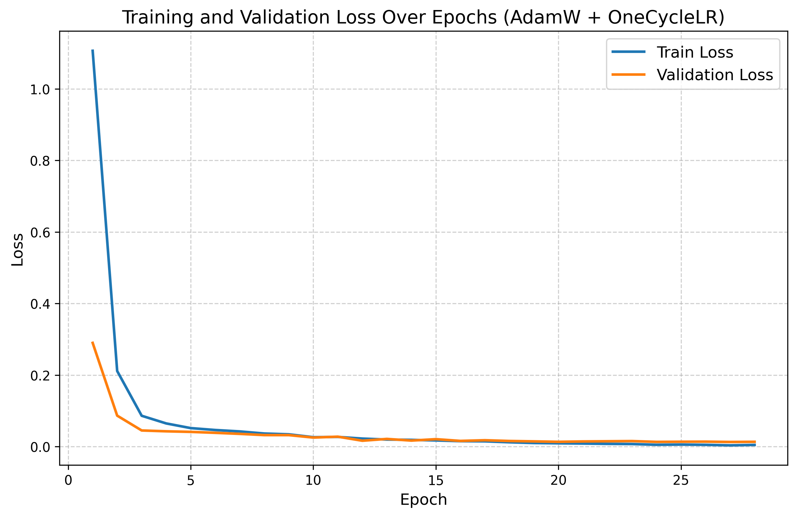
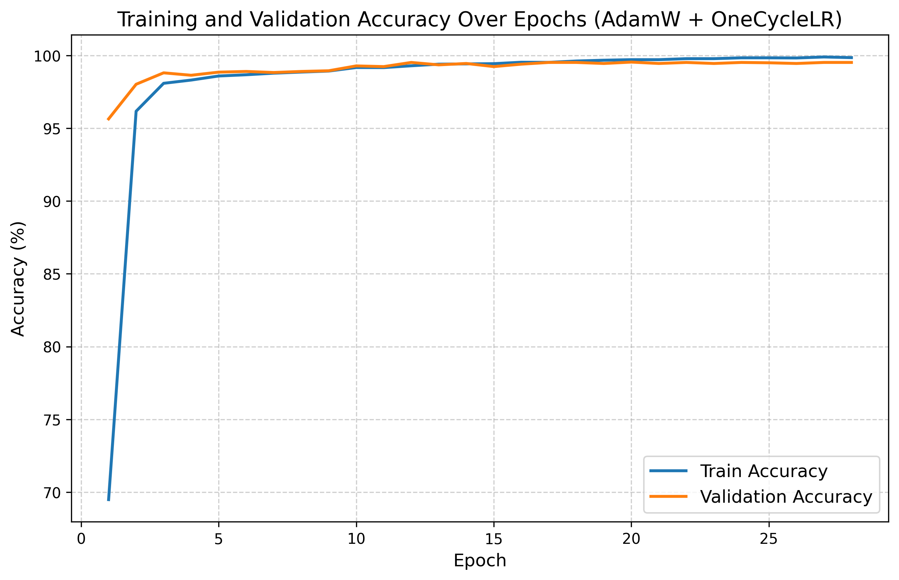

# 机器学习实验报告：基于CNN的手写数字识别

---

## 📋 学生信息

| 项目 | 内容 |
|------|------|
| **姓名** | 谢洁 |
| **学号** | 112305010107 |
| **班级** | 数据1231 |
| **实验日期** | 2026年5月 |

---

## 🔗 项目链接

| 平台 | 链接 |
|------|------|
| GitHub 仓库 | [https://github.com/xj0625/xj112305010107](https://github.com/xj0625/xj112305010107) |
| 实验报告 | [README.md](https://github.com/xj0625/xj112305010107/blob/main/README.md) |
| Kaggle 提交 | [Digit Recognizer](https://www.kaggle.com/competitions/digit-recognizer) |

---

## 📁 仓库结构

```
xj112305010107/
├── app.py                    # Gradio Web应用（实验二、三）
├── dnn_mnist.py              # CNN模型训练代码（实验一）
├── best_model.pth            # 训练好的模型权重
├── sample_submission.csv     # Kaggle提交文件
├── loss_curve.png            # Loss曲线图
├── acc_curve.png             # 准确率曲线图
├── requirements.txt          # 依赖列表
├── render.yaml               # Render部署配置
├── CNN手写数字识别实验模板.md # 实验报告模板
└── README.md                 # 项目说明与实验报告
```

---

## 🧪 实验一：模型训练与超参数调优

### 1.1 实验目标

使用卷积神经网络（CNN）完成 MNIST 手写数字识别，通过对比不同超参数配置，分析其对模型性能的影响。

### 1.2 模型结构

**最终模型架构：**

```
输入(1×28×28)
  ↓
Conv2d(1→48) + BatchNorm + SiLU
  ↓
Conv2d(48→48) + BatchNorm + SiLU + MaxPool + Dropout(0.2)
  ↓
Conv2d(48→96) + BatchNorm + SiLU
  ↓
Conv2d(96→96) + BatchNorm + SiLU + MaxPool + Dropout(0.2)
  ↓
Conv2d(96→192) + BatchNorm + SiLU
  ↓
Conv2d(192→256) + BatchNorm + SiLU + AdaptiveAvgPool + Dropout(0.3)
  ↓
Linear(256→10)
  ↓
输出(10类概率)
```

### 1.3 超参数对比实验

| 实验编号 | 优化器 | 学习率 | Batch Size | 数据增强 | Early Stopping | 验证准确率 |
|----------|--------|--------|------------|----------|----------------|------------|
| Exp1 | SGD | 0.01 | 64 | 否 | 否 | 99.21% |
| Exp2 | Adam | 0.001 | 64 | 否 | 否 | 99.19% |
| Exp3 | Adam | 0.001 | 128 | 否 | 是 | 99.26% |
| Exp4 | Adam | 0.001 | 64 | 是 | 是 | 99.38% |

### 1.4 最终模型配置

| 配置项 | 设置值 |
|--------|--------|
| 优化器 | AdamW |
| 学习率 | 0.003 |
| 权重衰减 | 1e-4 |
| Batch Size | 512 |
| 训练轮数 | 30 |
| 学习率调度器 | OneCycleLR (pct_start=0.3) |
| 数据增强 | 随机平移、旋转、缩放 |
| **Kaggle Score** | **0.99625** |

### 1.5 实验结果




### 1.6 问题分析

**Q1：Adam 和 SGD 的收敛速度差异？**
- Adam 收敛更快，自适应学习率使其在训练前期快速下降
- SGD 需要更多 epoch，但有时能获得更好的泛化效果

**Q2：学习率对训练稳定性的影响？**
- 学习率过大会导致 loss 震荡
- 学习率过小会减慢收敛速度
- OneCycleLR 调度器能兼顾训练速度和稳定性

**Q3：数据增强的作用？**
- 提升模型泛化能力
- 扩充有效训练样本
- 使模型学习更稳健的特征

---

## 🌐 实验二：模型封装与Web部署

### 2.1 实验目标

将训练好的 CNN 模型封装为 Web 应用，支持图片上传识别。

### 2.2 技术方案

使用 Gradio 框架构建 Web 应用：

```
用户上传图片 → 转为灰度 → 调整为28×28 → 归一化 → CNN推理 → 返回预测结果
```

### 2.3 部署配置

已配置支持 Render 平台部署，创建了 `render.yaml` 配置文件。

---

## ✏️ 实验三：交互式手写识别系统

### 3.1 实验目标

实现在线手写画板功能，支持实时手写数字识别。

### 3.2 功能实现

| 功能 | 状态 |
|------|------|
| 手写画板 | ✅ 已实现 |
| 实时识别 | ✅ 已实现 |
| Top-3 预测 | ✅ 已实现 |
| 概率分布条形图 | ✅ 已实现 |
| 连续识别历史 | ✅ 已实现 |
| 清空画板 | ✅ 已实现 |

---

## 📊 实验成绩

| 指标 | 结果 |
|------|------|
| Kaggle AUC | **0.99625** |
| 验证准确率 | 99.67% |
| 训练准确率 | 99.88% |

### Kaggle 提交结果截图


---

## 📝 提交清单

| 项目 | 状态 | 文件 |
|------|------|------|
| 实验代码 | ✅ | `dnn_mnist.py`, `app.py` |
| 模型权重 | ✅ | `best_model.pth` |
| Kaggle提交 | ✅ | `sample_submission.csv` |
| 实验报告 | ✅ | `README.md`, `CNN手写数字识别实验模板.md` |
| 结果截图 | ✅ | `loss_curve.png`, `acc_curve.png`, `kaggle_score.png` |
| 依赖清单 | ✅ | `requirements.txt` |

---

## 📌 注意事项

1. 每次实验后及时提交代码和报告
2. 提交说明清晰，便于追溯
3. 不上传敏感信息（密码、token等）
4. 保留实验过程，便于版本回退

---

*本实验报告遵循课程 GitHub 实验管理要求，确保实验过程可追溯、结果可回退。*